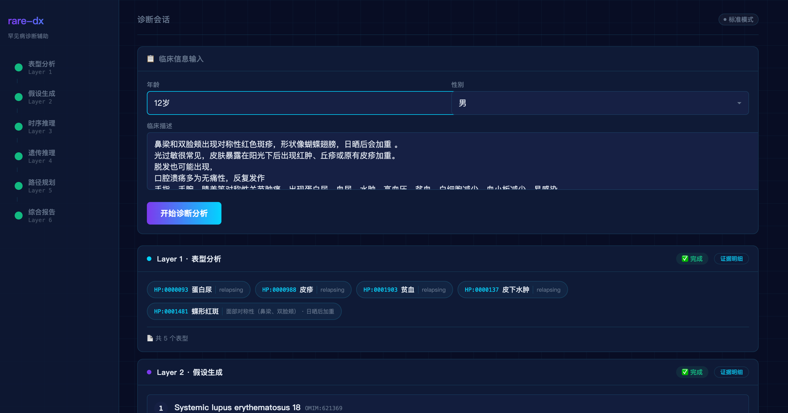

# rare-dx · 罕见病诊断辅助系统

> 医学 AI 极客松项目 — 五层临床推理引擎 + 循证证据池 + 全量表型词典

---

## 1. 项目简介

### 为什么做 rare-dx？

罕见病，不罕见。中国约有 2000 万罕见病患者，但绝大多数医生在临床上很少遇到这类病例。一个典型的罕见病患者往往要经历"确诊迷宫"——辗转多个科室、经历多次误诊，平均确诊时间长达 5-7 年。

rare-dx 的诞生，就是想帮医生缩短这段路。

它不是要替代医生的判断，而是把医生脑海中那些"经验性的推理过程"变得更结构化、更可追溯、更有据可查。当你面对一个复杂病例时，rare-dx 会像一位熟悉罕见病的顾问一样，帮你：

- 从杂乱的临床表现中梳理出关键表型
- 基于贝叶斯概率给出最可能的候选疾病排序
- 自动检索最新文献，告诉你这些假设有没有证据支撑
- 推荐下一步最该做的检查，避免盲目排查
- 最后生成一份结构化的诊断辅助报告，方便后续会诊和随访

### 目标受众

这个系统面向所有需要处理罕见病诊疗的临床场景：

- **罕见病诊疗中心**：专科医师需要快速整合多学科信息
- **各临床科室医师**：儿科、内科、神经科、皮肤科等，罕见病往往藏在常见科室里
- **遗传咨询师**：需要系统性的遗传模式分析和家系解读
- **临床药师**：药物治疗选择和不良反应评估
- **医学研究员**：需要标准化、可审计的推理链做研究素材
- **多学科诊疗（MDT）团队**：需要统一的推理语言和证据链来协作

### 解决的痛点

- 罕见病知识散在文献和数据库里，临床医生很难快速整合成可用的判断
- 表型和疾病之间的映射复杂，光靠记忆和经验容易漏诊
- 诊断过程缺少结构化记录，后续复盘、教学、会诊都不方便
- 不同学科背景的医生会诊时，缺乏统一的推理语言和证据链
- 很多基层医院缺少罕见病专科支持，优质诊断经验难下沉

---

## 2. 快速开始

### 魔搭展示链接

- [rare-dx · 罕见病诊断辅助系统](https://www.modelscope.cn/studios/zhangsan0226/rare-dx)

### 本地运行步骤

```bash
# 1. 克隆仓库
git clone https://www.modelscope.cn/studios/zhangsan0226/rare-dx.git
cd rare-dx

# 2. 安装依赖
pip install -e ".[dev]"

# 3. 配置环境变量
cp .env.example .env
# 编辑 .env，填入以下必需配置：
# - STEPFUN_API_KEY 或 DEEPSEEK_API_KEY（LLM 推理）
# - KNOWS_API_KEY + KNOWS_BASE_URL（循证检索）

# 4. 启动后端
python3 -m uvicorn app.main:app --host 0.0.0.0 --port 8765

# 5. 启动前端（新终端）
cd frontend && npm install && npm run dev -- -p 3001
```

### 访问应用

浏览器打开 `http://localhost:3001`

### 环境变量说明

| 变量 | 说明 | 必需 |
|------|------|------|
| `STEPFUN_API_KEY` | StepFun LLM API Key | 是 |
| `DEEPSEEK_API_KEY` | DeepSeek LLM API Key | 否（作为 fallback） |
| `KNOWS_API_KEY` | KnowS 循证检索 API Key | 是 |
| `KNOWS_BASE_URL` | KnowS 服务地址 | 否（默认 `https://api.nullht.com/v1`） |
| `OPENAI_API_KEY` | OpenAI API Key | 否（作为 fallback） |
| `QWEN_API_KEY` | 通义千问 API Key | 否（作为 fallback） |

---

## 3. 功能特性

- **循证医学贯穿全程**：不是只给结论，而是每层推理都自动检索多源医学证据，并按 A-E 分级，方便追溯原文
- **五层推理引擎**：模拟临床鉴别诊断的完整思路——从表型分析、假设生成、时序推理、遗传推理，到诊断路径规划，层层递进
- **全量表型词典**：内置 11,606 个 HPO 术语，并会随着使用不断学习积累，越用越准
- **贝叶斯概率推理**：基于 Orphanet/OMIM 的疾病-表型频率数据做量化评估，同时考虑年龄、性别等人口学因素
- **时序推理**：把发病年龄、进展速度、症状出现顺序也当成诊断信号，而不是只看孤立症状
- **遗传推理**：支持家系分析和孟德尔遗传模式推断，并在必要时自动回流验证
- **诊断路径规划**：用 EVOI 模型推荐"下一步最该做什么检查"，而不是泛泛列出检查项目
- **多源证据检索**：对接 KnowS 6 路证据源（PubMed 英文/中文、指南、临床试验、药品说明书），每层都有文献支撑
- **证据弹窗**：每个推理节点右上角会显示证据数量，点击即可看到文献标题、期刊、DOI、研究类型和证据等级
- **安全机制**：设置多道安全阀和三级闸门，遇到高风险、议题漂移或证据不足时会主动提示，不会硬出结论
- **LLM 兜底**：当统计模型没有命中或置信度不够时，会自动调用大模型生成候选假设，尽量不漏掉可能
- **持久化存储**：诊断会话和审计日志都会存下来，方便回溯、导出报告和后续随访

---

## 4. 典型使用场景

### 场景一：儿科不明原因发育迟缓

```
输入：男，3月龄，进行性肌张力低下，喂养困难，乳酸性酸中毒（血乳酸 5.2 mmol/L），眼球震颤

系统输出：
- Layer 1：提取 HPO:0001324（肌张力低下）、HP:0001945（发热）、HP:0003251（感觉异常）等
- Layer 2：Leigh 综合征（ORPHA:520）后验概率最高，证据强度 A
- Layer 3：发病年龄 3 月龄与 Leigh 综合征自然史高度匹配
- Layer 4：提示 mtDNA 突变需排查母系遗传
- Layer 5：推荐线粒体基因组测序 + 血乳酸/丙酮酸比值
```

### 场景二：成人反复发作性周围神经病

```
输入：男，28岁，反复双下肢无力，感冒后加重，腱反射消失，肌电图提示脱髓鞘改变

系统输出：
- Layer 1：GBS 相关表型（肌无力、腱反射消失、脱髓鞘）
- Layer 2：吉兰-巴雷综合征（ORPHA:309）排序第一
- Layer 3：急性进展模式与 AIDP 自然史吻合
- Layer 4：不支持遗传性神经病（急性起病）
- Layer 5：推荐腰穿 + 神经传导速度重复检测
```

### 运行结果截图

> 以下截图来自实际部署运行（魔搭创空间）




---

## 5. 数据来源与知识库

### 核心数据源

| 数据源 | 说明 | 用途 |
|--------|------|------|
| **Orphanet** | 欧洲罕见病数据库 | 疾病-表型频率数据、疾病元数据 |
| **HPO (Human Phenotype Ontology)** | 人类表型本体论 | 标准化表型术语（11,606 个 HPO 术语） |
| **OMIM** | 在线人类遗传学数据库 | 疾病基因关联、遗传模式 |
| **KnowS Evidence Search** | 多源医学证据检索 | PubMed 英文/中文、指南、临床试验、药品说明书 |

### 知识库规模

- **疾病覆盖**：12,958 个罕见病元数据（Orphanet + OMIM）
- **表型词典**：11,606 个 HPO 术语（全量加载）
- **频率数据**：267,633 条 HPO 频率条目（疾病-表型关联）
- **证据源**：6 路检索（paper_en / paper_cn / guide / trial / meeting / package_insert）

### 数据更新策略

- 知识库定期从 Orphanet/OMIM 同步更新
- LLM 学习缓存自动积累（term_name → hpo_id 映射）
- 证据检索实时查询 KnowS API，确保文献时效性

---

## 6. 架构概览

```
用户输入 (临床描述)
  │
  ├─ [Safety]    议题漂移检测 / 高风险关键词 / 跨层冲突 / 保守降级
  │
  ├─ Layer 1: 表型分析器      → LLM NER(主力) + 全量词典(11,606 HPO) 兜底 + KnowS 循证检索
  │    ├─ LLM≥5项: LLM为底座，词典补充遗漏
  │    └─ LLM<5项: 词典为底座，LLM补充
  │    └─ [学习缓存]  LLM提取的 term_name 自动持久化，逐步提升命中率
  │    └─ 输出: 结构化表型向量 + 证据池（guide/paper_en）
  ├─ Layer 2: 假设生成器      → 贝叶斯后验排序 Top-5 + KnowS 循证检索 + LLM 鉴别解释
  │    ├─ 贝叶斯命中：计算后验概率 + 证据强度 + KnowS 检索（paper_en/paper_cn）
  │    └─ 贝叶斯无命中/低置信度：LLM 直接生成候选疾病假设 + 证据补充
  │    └─ 输出: 排序假设列表 + 证据池 + 鉴别诊断链
  ├─ Layer 3: 时序推理器      → 发病年龄/进展模式匹配 + KnowS 自然史证据检索
  │    └─ KnowS: PubMed + MedlinePlus 检索自然史文献
  │    └─ 输出: 时序匹配度 + 证据池
  ├─ Layer 4: 遗传推理器      → 孟德尔模式推断 + KnowS 遗传咨询证据检索
  │    └─ KnowS: Orphanet + 指南检索遗传咨询证据
  │    └─ 输出: 遗传模式 + 兼容性分析 + 证据池
  ├─ Layer 5: 路径规划器      → EVOI 排序推荐检查 + KnowS 检查方法学证据检索
  │    └─ KnowS: ClinicalTrials + PubMed 检索检查方法学证据
  │    └─ 输出: 诊断路径 + 证据池
  │
  ├─ Layer 6: 报告综合器      → 结构化报告 + LLM 临床印象 + 全链路证据汇总
  │
  └─ [Persist]  SQLite 保存会话 + 审计日志（含完整证据链）
```

---

## 7. API 端点

| 方法 | 路径 | 说明 |
|------|------|------|
| `GET` | `/api/health` | 健康检查 |
| `GET` | `/api/diagnostic/stream` | SSE 流式诊断（6 层推理 + 证据推送） |
| `GET` | `/api/report/download` | 下载 DOCX/PDF 报告 |
| `GET` | `/api/sessions` | 历史会话列表（SQLite 持久化） |
| `GET` | `/api/sessions/{id}` | 某会话完整状态 |
| `GET` | `/api/sessions/{id}/audit` | 某会话审计日志 |
| `DELETE` | `/api/sessions/{id}` | 删除会话 |

### SSE 事件类型（14 种）

| 事件 | 说明 |
|------|------|
| `round_start` | 推理回合开始 |
| `agent_start` / `agent_delta` / `agent_done` | Agent 生命周期 |
| `phenotype_vector` | Layer 1 表型向量（含 metrics：LLM/词典/合并数量） |
| `hypothesis_ranking` | Layer 2 贝叶斯排序（含 LLM 兜底标注） |
| `temporal_match` | Layer 3 时序匹配 |
| `inheritance_pattern` | Layer 4 遗传模式 |
| `evoi_recommendation` | Layer 5 EVOI 路径 |
| `report_delta` | Layer 6 综合报告 |
| `evidence` | 逐层循证证据（含 DOI 跳转 URL） |
| `safety_valve` | 安全阈值触发事件 |
| `round_end` | 推理回合结束 |
| `error` | pipeline 异常 |

---

## 8. 项目结构

```
rare-dx/
├── app/
│   ├── agents/           # 6 个推理 Agent（phenotype → report）
│   ├── reasoning/        # 算法层（bayesian / temporal / inheritance / evoi）
│   ├── tools/            # KnowS 客户端 / LLM 网关 / 证据分级 / 报告导出
│   ├── storage/          # SQLite 持久化存储（session + audit）
│   ├── models/           # Pydantic 数据模型
│   ├── api/              # FastAPI 路由 + SSE 端点 + 会话管理
│   ├── safety/           # 4 类安全阀 + 3 档闸门
│   └── audit/            # 审计日志
├── frontend/             # Next.js 14 + TypeScript
│   └── src/components/   # 11 组件 + EvidenceModal 证据弹窗
├── config/               # YAML 配置（LLM providers / 路径等）
├── data/                 # 全量表型词典 + 频率表 + 疾病元数据
│   ├── disease_meta.json          12,958 疾病元数据
│   ├── hpo_frequency/
│   │   └── orphanet_freq.json     267,633 条 HPO 频率条目
│   ├── hpo_dictionary.json         11,606 个 HPO 全量词典
│   └── hpo_learned_keywords.json   LLM 学习缓存（自动积累）
├── docs/                 # PRD / ARCHITECTURE / API 文档
├── .atomcode/
│   └── skills/           # AtomCode 子代理（安全审查/API文档/测试生成）
├── .env.example          # 配置模板（去敏）
├── .mcp.json             # MCP 服务（context7 + Playwright）
└── tests/                # 65+ 测试（含 golden 回归基线）
    ├── golden/           # D1/D2/D3 回归基线 expected.json
    └── test_golden.py    # 8 个 golden 回归测试
```

---

## 9. 技术栈

| 层 | 技术 |
|---|------|
| 后端 | Python 3.12+ / FastAPI / LangGraph / Pydantic v2 |
| 前端 | Next.js 14 / TypeScript / Tailwind / shadcn/ui |
| LLM | DeepSeek-V3 / GPT-4o / Qwen / StepFun (`step-3.7-flash`) |
| 证据 | KnowS Evidence Search API（6 源：paper_en/paper_cn/guide/trial/meeting/package_insert） |
| 知识库 | HPO / Orphanet / OMIM（11,586 个 HPO 频率条目，12,958 疾病）|
| 存储 | SQLite（诊断会话 + 审计日志持久化）|

---

## 10. 测试覆盖

```
65 passed, 0 failed, 2 skipped  in 102s

├── test_reasoning.py    15  算法层（含 min_posterior 阈值测试）
├── test_agents.py        10  Agent 层
├── test_safety.py        12  安全机制
├── test_tools.py         8   工具层
├── test_graph.py         5   状态机
├── test_api_routes.py    9   API 集成
├── test_d1_smoke.py      3   D1/D2/D3 冒烟
└── test_golden.py        8   D1/D2/D3 回归基线
```

---

## 11. 开发历程与设计理念

### 从临床痛点出发

rare-dx 的开发始终围绕一个核心问题：**"如果给我 10 分钟，我能给患者什么？"**

在罕见病诊疗中，时间就是生命。一个经验丰富的罕见病专家可能需要几十年积累才能建立直觉，而年轻医生往往没有这个机会。我们想做的是，把专家的思维过程"翻译"成机器可以执行、医生可以理解的步骤。

### 设计原则

1. **循证为本**：每一个输出都必须有文献支撑，拒绝"黑箱"结论
2. **透明可审计**：推理链全程记录，每一步都可追溯、可验证
3. **安全优先**：宁可保守降级，也不虚构不确定的结论
4. **医生主导**：系统是辅助工具，最终判断权永远在医生手中
5. **持续进化**：通过 LLM 学习缓存和知识库更新，越用越准

### 技术演进路径

- **V1.0**：基础贝叶斯推理 + 静态知识库
- **V2.0**：引入 LangGraph 状态机，实现六层递进推理
- **V3.0**：集成 KnowS 循证检索，每层自动检索文献
- **V4.0**：增加 LLM 兜底 + 词典学习缓存 + 安全机制
- **V5.0**：SSE 流式输出 + 证据弹窗 + 报告导出

---

## 12. 局限性与未来规划

### 目前版本存在的不足

1. **LLM 依赖外部 API**：推理质量依赖 StepFun/DeepSeek 等 LLM 服务，需要网络连接和 API Key
2. **知识库覆盖有限**：当前基于 Orphanet/OMIM 预置数据，对超罕见病或新发病种的覆盖不足
3. **证据源依赖第三方**：KnowS 循证检索依赖外部服务，可能存在限流或服务不可用情况
4. **无图像/影像分析**：当前仅支持文本输入，不支持医学影像（如 MRI、CT）的自动分析
5. **演示模式降级**：无 LLM 或低置信度时可能触发 conservative_downgrade，导致假设被清空
6. **家系分析简化**：当前遗传推理仅基于文本描述的家系信息，未支持标准 pedigree 图表输入

### 未来拟加入的新功能

1. **多模态输入**：支持上传医学影像、实验室报告、基因检测结果
2. **本地 LLM 支持**：集成 Ollama/llama.cpp 等本地模型，降低对外部 API 的依赖
3. **知识图谱增强**：与 Orphanet/OMIM/HGNC 等官方知识图谱直接对接，实时更新
4. **协作诊断**：支持多医生会诊模式，共享推理链和证据
5. **个性化患者画像**：整合患者历史诊疗数据，提供长期随访的疾病轨迹分析
6. **教育模式**：面向医学生的交互式教学模块，展示诊断推理过程

---

## 13. 团队与致谢

### 成员介绍及分工

| 成员 | 分工 |
|------|------|
| zhangsan0226 | 项目架构设计、五层推理引擎、贝叶斯概率计算、安全机制、全栈开发 |

### 致谢

这个项目能跑起来，离不开很多人的支持，在此一并感谢：

- **小X宝**：活动主办方，提供了这么好的比赛舞台和全程运营支持，让想法有机会落地
- **魔搭 ModelScope 社区**：中国最大的模型开源社区，提供了稳定可靠的赛事平台和算力资源
- **KnowS**：合作方，提供医学循证证据检索 API、开发者 Skill 支持与会员权益，让每层推理都能找到文献依据
- **Sealos（FastGPT）**：技术支持方，提供 RAG 能力与相关技术支持，帮助参赛团队快速构建知识库检索增强应用
- **阶跃星辰 StepFun**：大模型赞助方，提供 Flash Pro / Flash Max 大模型套餐权益，为推理引擎提供强大底座
- **LangGraph** — 状态机工作流框架
- **FastAPI** — 高性能 Web 框架
- **Next.js** — React 全栈框架
- **Orphanet** — 罕见病知识库（疾病-表型频率数据）
- **HPO** — 人类表型本体论
- **shadcn/ui** — UI 组件库

---

## 14. 文档

- [PRD 需求文档](docs/PRD.md)
- [系统架构设计](docs/ARCHITECTURE.md)
- [技术设计书](docs/TECHNICAL_DESIGN.md)
- [API 接口文档](docs/API.md)

---

## 15. 伦理安全

本系统遵循五铁律：

1. **禁止确诊**：不输出确诊结论，仅提供辅助推理
2. **医师为责任主体**：一切临床决策由签字执业医师做出
3. **拒绝优于编造**：无证据时明确告知，不虚构推理结果
4. **全链路审计不可关闭**：每一步推理均有日志记录
5. **原则凌驾一切**：安全机制优先级高于任何推理结果

---

## 16. 免责声明

本系统仅供辅助参考，不构成临床诊断指令。一切临床决策的唯一责任主体是签字执业医师。
